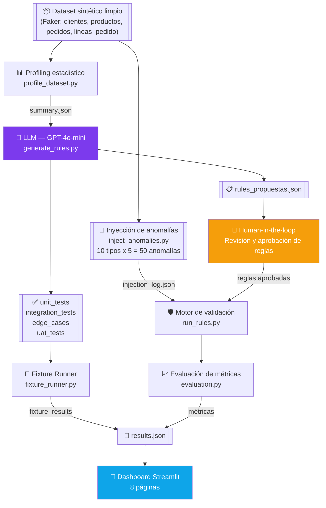
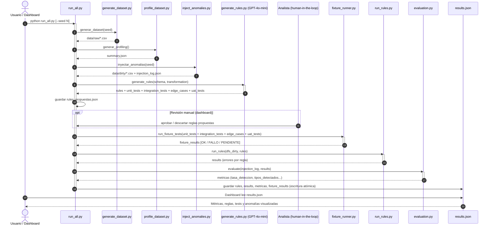
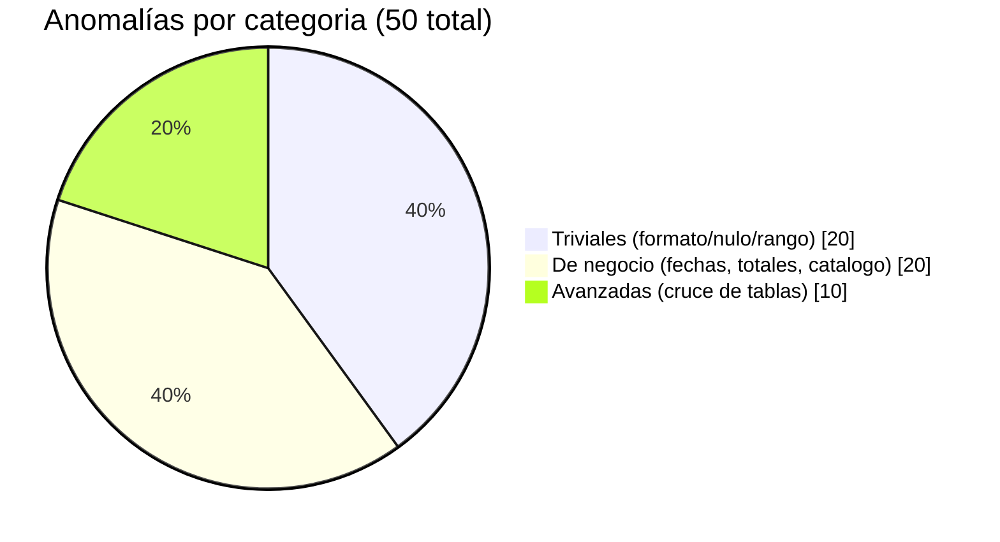

# 🔍 Data Quality Guardian — Hackathon Atmira 2025

**Reto 03 — Mejora de la calidad del dato y reducción de incidencias en producción**

Sistema de detección de anomalías en datos que usa IA generativa para analizar un dataset,
generar automáticamente reglas de calidad y casos de prueba de transformaciones ETL, y
validar ambos antes de que los datos lleguen a producción.

> Equipo: Pablo Tovar y Juan Torres — estudiantes de informática  
> Hackathon de Atmira, 22 junio – 10 julio 2025

---

## 📌 El problema

Los errores en los datos suelen llegar a producción porque la validación se hace de forma
manual, es lenta y nunca cubre todos los casos. Además, la mayoría de sistemas de validación
solo comprueban que **el dato en sí** esté bien formado (¿el email tiene `@`? ¿el precio es
positivo?), pero no comprueban que **la lógica de las transformaciones ETL** produzca el
resultado correcto (¿el total del pedido realmente coincide con la suma de sus líneas?).

## 💡 La solución

Un pipeline en el que una IA generativa (GPT-4o-mini):

1. Analiza el perfil estadístico del dataset.
2. Genera automáticamente **reglas de calidad del dato**.
3. Genera automáticamente **casos de prueba de transformaciones ETL** (unit tests,
   integration tests, edge cases, UAT tests).
4. Un humano revisa y aprueba las reglas antes de ejecutarlas (*human-in-the-loop*).
5. El motor de validación aplica las reglas aprobadas sobre el dataset.
6. Un fixture runner ejecuta los tests generados contra la lógica real de transformación.
7. Todo se visualiza en un dashboard interactivo con métricas de detección.

---

## 🏗️ Arquitectura del pipeline



### Descripción de cada paso

| Paso | Script | Lee | Escribe |
|---|---|---|---|
| 1. Generación de dataset | `src/generator/generate_dataset.py` | — (genera desde cero) | `data/raw/*.csv` |
| 2. Profiling | `src/profiling/profile_dataset.py` | `data/raw/*.csv` | `data/profiling/summary.json` |
| 3. Inyección de anomalías | `src/generator/inject_anomalies.py` | `data/raw/*.csv` | `data/dirty/*.csv`, `injection_log.json` |
| 4. Generación de reglas (LLM) | `src/llm/generate_rules.py` | `summary.json` + descripción de transformaciones | `rules_propuestas.json` |
| 5. Fixture Runner | `tests/fixture_runner.py` | tests generados por el LLM | `results.json` (`fixture_results`) |
| 6. Validación + evaluación | `src/validation/run_rules.py`, `src/evaluation/evaluation.py` | `data/dirty/*.csv` + reglas aprobadas | `results.json` (`rules`, `results`, `metricas`) |
| 7. Dashboard | `dashboard/app.py` | `results.json`, `summary.json`, `injection_log.json` | — (visualización) |

---

## 🔁 Diagrama de secuencia — ejecución de `run_all.py`



---

## 🧬 Dataset sintético (dominio e-commerce)

Generado con Faker (seed configurable para reproducibilidad):

| Tabla | Filas | Columnas clave |
|---|---|---|
| `clientes` | 200 | cliente_id, nombre, email, fecha_registro, pais, fecha_nacimiento |
| `productos` | 50 | producto_id, nombre, categoria, precio_unitario, stock |
| `pedidos` | 500 | pedido_id, cliente_id, fecha_pedido, fecha_entrega, estado, total |
| `lineas_pedido` | ~1800 | linea_id, pedido_id, producto_id, cantidad, precio_unitario |

## 🧪 Anomalías inyectadas (10 tipos, 50 en total)



| Categoría | Tipo | Tabla |
|---|---|---|
| Trivial | email_formato_invalido | clientes |
| Trivial | precio_negativo | productos |
| Trivial | cantidad_cero | lineas_pedido |
| Trivial | nulo_en_campo_obligatorio | pedidos |
| Negocio | fecha_entrega_anterior_pedido | pedidos |
| Negocio | total_pedido_incorrecto | pedidos |
| Negocio | precio_linea_distinto_catalogo | lineas_pedido |
| Negocio | pedido_entregado_fecha_futura | pedidos |
| Avanzada | stock_superado | productos |
| Avanzada | fecha_registro_posterior_pedido | clientes |

## 🛡️ Reglas de validación soportadas (`run_rules.py`)

| Tipo | Descripción | Requiere |
|---|---|---|
| `null_check` | Campo no puede ser nulo | `column` |
| `positive_check` | Campo debe ser > 0 | `column` |
| `email_check` | Formato de email válido | `column` |
| `date_order_check` | Una fecha posterior a otra | `column_after`, `column_before` |
| `delivered_future_check` | Pedido entregado no puede tener fecha futura | — |
| `total_check` | total = SUM(cantidad × precio_unitario) | — |
| `stock_check` | Cantidad pedida ≤ stock disponible | — |
| `registration_date_check` | Registro no posterior al primer pedido | *(roadmap)* |

## 🔧 Fixture Runner — validación de transformaciones

A diferencia del motor de reglas (que valida **el dato**), el fixture runner valida **la
lógica de la transformación** contra inputs conocidos:

| Tipo de test | Input esperado | Expected |
|---|---|---|
| `total_check` | `{"lineas": [{"cantidad": N, "precio_unitario": X}]}` | número |
| `stock_check` | `{"stock": N, "cantidad_total": M}` | true/false |
| `date_order_check` | `{"fecha_pedido": "...", "fecha_entrega": "..."}` | true/false |
| `delivered_future_check` | `{"estado": "...", "fecha_entrega": "..."}` | true/false |
| `email_check` | `{"email": "..."}` | true/false |
| `positive_check` | `{"valor": N}` | true/false |

---

## 📊 Resultados actuales

| Métrica | Valor |
|---|---|
| Anomalías inyectadas | 50 |
| Tipos de anomalía distintos | 10 |
| Tipos detectados | 9 / 10 |
| **Tasa de detección** | **90%** |
| Tipo no detectado | `fecha_registro_posterior_pedido` (roadmap) |
| Fixture tests | ~9 OK / ~1 FALLO / ~1 pendiente |

> **Por qué no es 100%:** el tipo `registration_date_check` requiere cruzar dos tablas
> (clientes y pedidos) y el motor de validación actual aún no lo implementa. Preferimos
> mostrar esta limitación de forma transparente antes que ocultarla — forma parte del
> roadmap del proyecto.

---

## 📱 Dashboard (Streamlit)

| Página | Contenido |
|---|---|
| Resumen | Métricas globales + fecha de última ejecución |
| Profiling del dataset | Estadísticas por tabla y columna |
| Anomalías inyectadas | Gráfico + tabla filtrable |
| Revisión de reglas | Human-in-the-loop: aprobar/descartar reglas |
| Reglas generadas | Reglas del LLM, gráfico por tipo, detalle por tabla |
| Tests IA | Fixture tests con resultado OK / FALLO / PENDIENTE |
| Estabilidad del sistema | Análisis de consistencia del LLM entre ejecuciones |
| Resultados y métricas | Tasa de detección + comparativa inyectadas vs detectadas |

**Funcionalidades del sidebar:**
- ▶️ Ejecutar pipeline completo en vivo
- 🎲 Checkbox para generar dataset nuevo con seed aleatoria (demo de generalización)
- 📄 Exportar informe PDF con fecha del último análisis (7 secciones)

---

## 🗂️ Estructura del repositorio

```
atmira-hackathon-dataquality/
├── run_all.py                          # Pipeline completo end-to-end
├── dashboard/
│   └── app.py                          # Dashboard Streamlit (8 paginas)
├── src/
│   ├── generator/
│   │   ├── generate_dataset.py
│   │   └── inject_anomalies.py
│   ├── profiling/
│   │   └── profile_dataset.py
│   ├── llm/
│   │   └── generate_rules.py
│   ├── validation/
│   │   └── run_rules.py
│   ├── evaluation/
│   │   └── evaluation.py
│   └── analysis/
│       └── stability_analysis.py
├── tests/
│   └── fixture_runner.py
├── experiments/
│   └── run_pipeline.py
└── data/                                # Generado automaticamente (.gitignore)
    ├── raw/
    ├── dirty/
    ├── profiling/
    └── results.json
```

---

## ⚙️ Stack técnico

| Componente | Tecnología |
|---|---|
| Lenguaje | Python 3.12 |
| LLM | GPT-4o-mini (OpenAI API) |
| Generación de datos | Faker |
| Análisis de datos | pandas |
| Dashboard | Streamlit |
| Exportación PDF | ReportLab |
| Control de versiones | Git + GitHub |

---

## 🚀 Cómo ejecutarlo

```bash
# 1. Clonar el repositorio
git clone https://github.com/pablotp02/atmira-hackathon-dataquality
cd atmira-hackathon-dataquality

# 2. Instalar dependencias
pip install -r requirements.txt

# 3. Configurar la API key de OpenAI
echo "OPENAI_API_KEY=tu_api_key" > .env

# 4. Ejecutar el pipeline completo
python run_all.py

# (opcional) con seed aleatoria para generar un dataset nuevo
python run_all.py --seed=123

# 5. Levantar el dashboard
streamlit run dashboard/app.py
```

---

## 🎯 Diferencial del proyecto

- La IA no solo genera **reglas de calidad del dato**, también genera y ejecuta
  **casos de prueba de transformaciones ETL** (unit, integration, edge cases, UAT) —
  cubriendo la parte del reto que suele pasarse por alto.
- **Human-in-the-loop**: la IA propone, el analista decide qué reglas aplicar.
- **Análisis de estabilidad**: el sistema registra el historial de reglas generadas en cada
  ejecución y permite llamar al LLM para que analice si sus propias respuestas son consistentes
  entre ejecuciones con distintos datasets — una IA evaluando a otra IA.
- **Transparencia sobre limitaciones**: mostramos honestamente el 10% no detectado y por qué,
  en vez de presentar una tasa de detección artificialmente perfecta.
- **Demo en vivo**: el dashboard permite regenerar el dataset con una seed aleatoria delante
  del jurado, demostrando que el sistema generaliza y no está sobreajustado a un caso fijo.

---

## 📅 Roadmap

- [ ] Implementar `registration_date_check` en el motor de validación (cruce clientes/pedidos).
- [ ] Análisis de estabilidad en lote: ejecutar N ejecuciones seguidas y comparar consistencia estadística.
- [ ] Añadir detección de anomalías estadísticas (outliers) y semánticas.
- [ ] Tests automatizados (`pytest`) sobre el propio motor de validación.